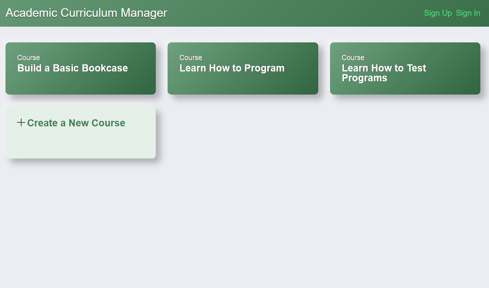
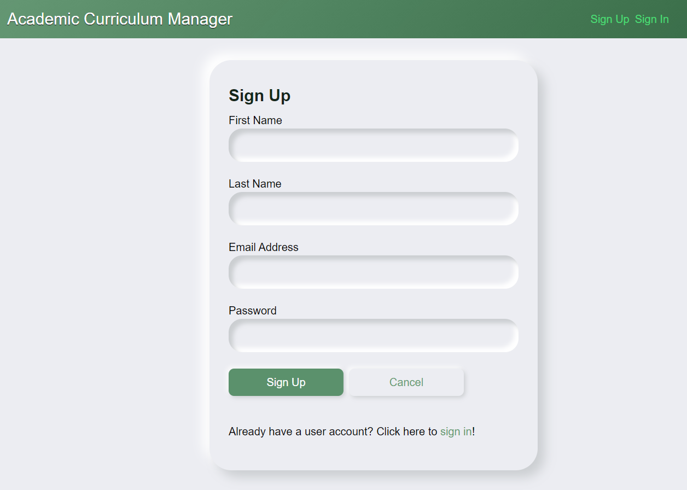

# Academic Curriculum Manager (Client)

The frontend portion of the Academic Curriculum Manager application, which was the second half of the full-stack project.  Written in React to utilize all of the basic functionality of a website.  From creating the display to user authorization, data validation and accessibility.

A live demo can be found [here](https://portfolio-acm-client.netlify.app/).  The server backend repository can be found [here](https://github.com/jimjitsuesq/portfolio-acm-server).

## Table of Contents

* [General Info](#general-information)
* [Technologies Used](#technologies-used)
* [Features](#features)
* [Screenshots](#screenshots)
* [Contact](#contact)

## General Information

- This was the tenth project in my Team Treehouse Full-Stack JavaScript Tech Degree.
- Received grade of "Exceeds Expectations" (highest available).
- The main focus was writing a frontend application to interact with the server written in the previous project.
- After I completed the Treehouse Tech Degree, I rewrote the JavaScript class-based functions into modern React Hooks to make it cleaner and more functional, as well as to practice those newer features.

## Technologies Used

- ReactJS
- Axios
- HTML
- CSS

## Features

- User authorization
- Displays the site, interacts with the server, handles data validation and makes the site more responsive.

## Screenshots

## Contact

Created by [@jimjitsuesq](https://www.jimpeters.dev/).  Feel free to contact me!
